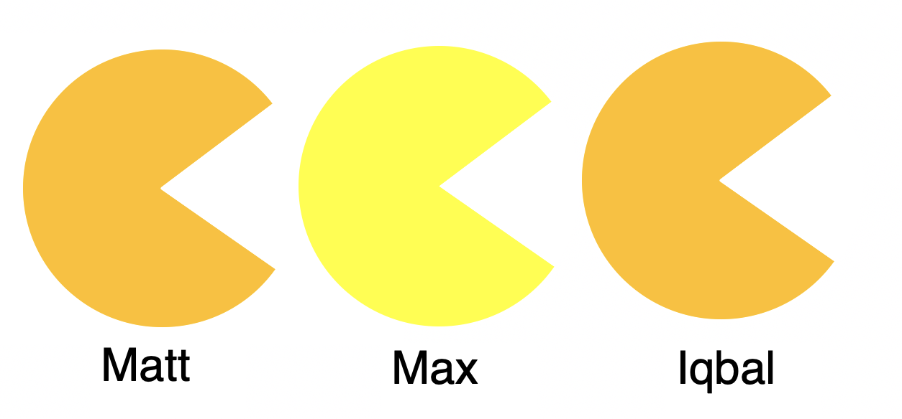

# UoM COMP90054 Contest Project

## Brought to you by the 'Cheeky Pacmen' team

### Team Members

* Waneya Iqbal        - iqbalw@student.unimelb.edu.au     - 919750
* Maxim Mattvey       - mattveym@student.unimelb.edu.au   - 694125
* Matthew O'Halloran  - mohalloran@student.unimelb.edu.au - 702322

## Contents

- [1. Home](/1 Home)
- [2. Design Choices](/2 Design choices)
    - [3.1 Approximate Q Learning](/3.1 Approximate Q Learning)
    - [3.2 Heuristic Search Algorithms](/3.2 Heuristic Search Algorithms)
    - [3.3 Game Theoretic Methods](/3.3 Game Theoretic Methods)
    - [3.4 Goal Recognition](/3.4 Goal Recognition)
- [4 Experimental evolution](/4 Experimental Evolution)

[Next Page ](/2 Design Choices)

# Youtube presentation

<figure class="video_container">
  <iframe src="https://www.youtube.com/embed/enMumwvLAug" frameborder="0" allowfullscreen="true"> </iframe>
</figure>
