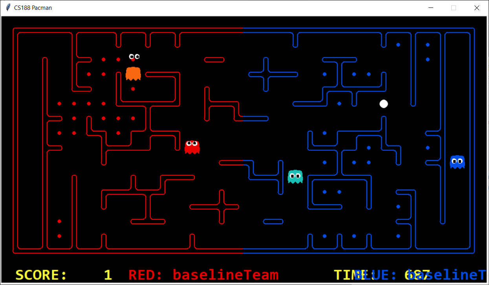
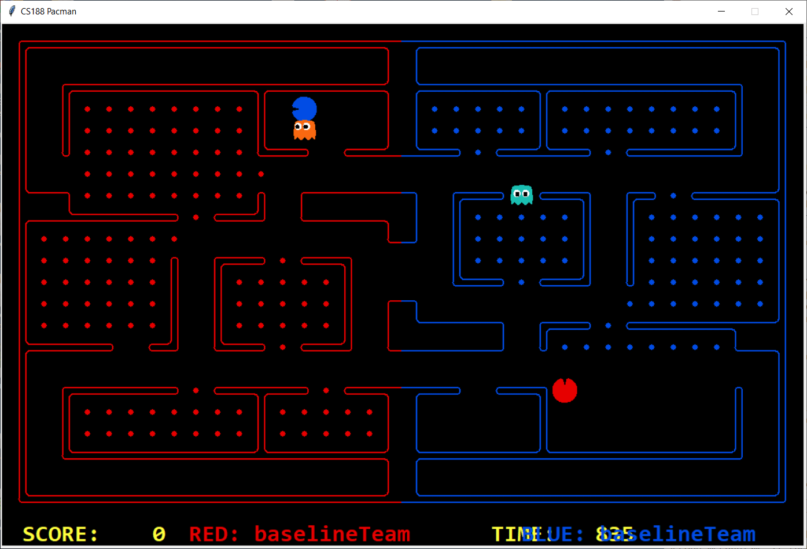

# Features #

***feature name***
*  problem feature is intended to address:
*  Effectiveness of feature in addressing that problem:

## First attempt at running from enemies

# Demo

# Normalisation