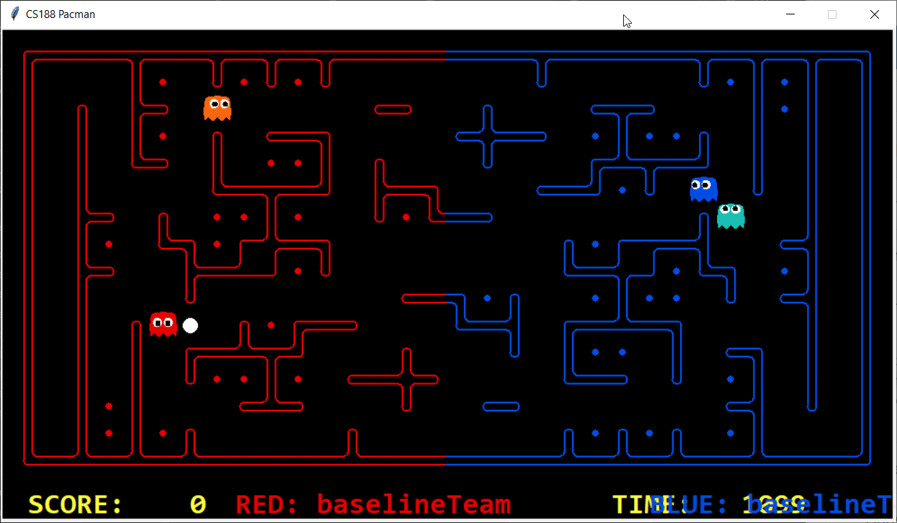

#Approach 4: Goal recognition (to infer intention of opponenets)

## Recognising non-visible enemy pacman is eating food

Because of agents being visible within only 5 manhattan distance, it is difficult to accurately distinguish where an agent is located outside of that range. Although a noisy distance is provided, this distance only provides a range of possible positions from an agent inquiring the noisy distance of others - and so, does not indicate which direction the un-seen agent(s) are. 

Being able to accurately understand where an agent is, is useful to agents when they are in their home territory (defending) and in enemy territory (eating food). Through this game, we have found an alternative method to identify accurate positions of only enemy agents when they are eating food. This is useful to agents that are attempting to defend home territory since the enemy pacman may have entered the home territory from an unseen position of the border. Whenever an enemy agent eats a food, we are able to recognise their exact position through the mapping of the food-grid. This can allow defensive agents to find an unseen enemy pacman eating food - something that is valued greatly as maps get larger and the possibility of an enemy agent entering home territory unseen is greater.

Challenges experienced:
* Even though an exact position can be obtained of enemy pacmen upon eating food, it is difficult to understand which direction they are headed afterwards. If after an enemy pacman has eaten a food, we can attempt to goal infer that they will either continue to eat food nearby, or head home with some probability to guarantee their haul. As they eat more food, we can attempt to attribute greater probability that they will head home and vice-versa. Thus, a defensive agent can attempt to gradually move towards an enemy pacman with the intentions of intercepting them, depending on which direction they expect them to be heading in.
*  Once we know a pacman has eaten a food, after 1 turn, we know that they are constraint to be at maximum 1 maze distance away from that position, and so on each turn. However, it is difficult to know which direction they are headed in.

Possible Improvements:
* For future possible improvements, it is possible to mechanically derive a probability-based table of an unseen enemy pacman's position by combining the aforementioned constraint, and noisy distance. For example, noisy distance allows us to know probabilistically, whether an enemy is moving closer, or further away. This, combined with an exact position at a single turn of an enemy pacman, and the constraint of maze distance, can be used to maintain a more accurate probabilistic measure of both distance away from an enemy pacman, and also their likely position. 
* For maximising probability of correctly inferring the intentions of an enemy agent, and the method in which they seek food (to accurately know where they are probably headed next), it is possible to utilise machine learning methods off-policy amongst a range of enemy tactics, mixed with some on-policy tweaking during actual gameplay (as some enemy agent tactics may differ to previously seen samples).

## Recognising enemy defensive agent goals

A problem that we've tackled is the case where enemy ghosts are defensive around the centre of the map, leading to an obstruction of our offensive agents. We have attempted to identify when this occurs through features, and in general, e.g. if it occurs near the bottom or top of a map as well. For example, in the scenario below, our offensive red agent gets caught while trying to cross over into enemy territory, and then infers that the enemy will likely be around that area in the future, so it may prefer crossing over the top (or bottom, randomly choosing a food in either section and setting it as the initial goal).

Challenges experienced:
*  Sometimes an offensive agent gets caught on the retry, and so we generalised to get out of vision of the enemy agent before attempting once again. This is also a potentially time-saving and dominating strategy to the case above where our offensive agent simply died (even though it could have possibly avoiding doing so).
* It is difficult to understand whether an enemy defensive agent will remain in the same location or not after first encountering it there and then leaving visible range. However, a random re-entry position seems to solve this fine. 

Possible improvements:
* This could be extended to cooperative behaviour with ally agents, because e.g. if our two agents are set to offensive, they could communicate by probabilistically inferring that they are headed to explore a certain region, entering by top or bottom, with probability increasing as they either get closer to different regions of the map and closer to enemy territory before entry. In a 2-agent scenario, this is not necessary, but in an increasingly multi-agent scenario, this would become increasingly important.
* Coupling the random re-entry location decision with game theory would be complimentary as we wish to maximise offensive agent re-entry success chance, preferably without being revealed to the enemy - and game theory would also aid in an extended multiple turn setting, whereby re-entry locations (e.g. from top, centre, bottom) can be considered as the actions.