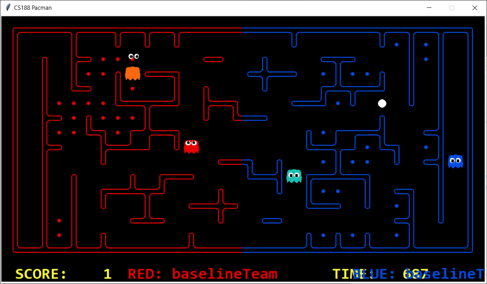

# Features #

### Offensive features

* deadEndWithActiveGhostNearbyFeature: Avoid entry to dead Tunnels (with no exit) , when enemy is nearby to prevent ending up in dead ends. A demo is given in Heuristic Search Algorithms
* {1-3} stepsFromEnemyAgent1
* {1-3} stepsFromEnemyAgent2
* isSuccessorCloserToChoosenPoint
* closenessToOptimizedFood: optimized food is the food which is not near to enemy (applicable if enemy is visible)
* ActionsAvailableActiveGhostNearbyFeature: When enemy is nearby, this feature will cause offensive agent to prefer
paths with more future actions available, this ensures smooth movement of pacman without causing him to enter in traps. 
* foodEaten
* capsuleEatenWithEnemyNearBy: Pacman will try to eat capsule when enemy is nearby otherwise tries to avoid it as much as possible.

### Defensive features

* becomesPacman
* isSuccessorCloserToChosenPoint
* {1-3} stepsFromEnemyAgent1
* {1-3} stepsFromEnemyAgent2

### Hybrid (reflexive) features

*

***Please note that, for clarity, the agents in the demos will be referenced by their respective colour - i.e. red & orange for the RED team, blue & teal for the BLUE team. Our agents may switch from either team throughout each video, but will be identified under the respective demo.***

***feature name***
*  problem feature is intended to address:
*  Effectiveness of feature in addressing that problem:

## Offensive agent - fleeing from enemy ghost, (and pacman!)

Our agent is the blue offensive agent. Our first attempt to stop our offensive agent from being eaten by enemy agents was to add a feature to maximise the maze distance from an encountered enemy. 

# Demo

A pitfall of the first feature is demonstrated here - our Red offensive agent enters a dead end and is caught by the enemy agent. 

3- A possible solution was to add a feature which assessed the number of future actions available. This did not worked as expected. We found it difficult to favour paths closer to food or paths with more possible actions. As a result the agent remained confused as to go where. This confusion is clearly evident in the attached replay (red agent) from 1100-1000 [3_replay-Problem](uploads/91cb0bffcb7f3812888045b7d05c7379/3_replay-Problem)

4- To solve the confusion above, we added a simple condition - only consider the future distance when the enemy is nearby. After all the agent should (in most cases) avoid dead ends (with or without food) when the enemy is nearby. We therefore solved 3 by calculating the future value only when the opponent is in proximity.
The replay below from between 1200 and 950 (red) it can be clearly seen that pacman is no more confused and it also avoids dead end when enemy is nearby. We only considered a depth of 7 with this feature at that time.[4_replay](uploads/164dc8bc3345304bd907ec1e40a75c6f/4_replay) 

Inspired with success of 4, we added a new feature to check ratio of available food/unavailable food to n-depth. The idea is to favour paths where more food is available. This proved to be a bad feature as the pacman continued to roam randomly and move back and forth. Thus, we dropped the feature.

5.  After that we added a feature to chasing scared ghost by Defensive agent. (We also added it to offensive agent when it is in home territory Later on we found experimentally that this feature is causing offensive agent to forget its actual work of collecting food and focus on eating enemies in home territory. Hence we removed it). This feature can be seen in replay below from 500-300[5-replay-OffensiveAgentCanChaseScaredOpponents](uploads/e0d9b51713f67a7b2f5afa1c02d32bc4/5-replay-OffensiveAgentCanChaseScaredOpponents)

6. We have observed a behaviour as shown below. Our offensive blue agent is trapped b/w wall and enemy and food collection is halted.

To avoid such halting of food collection. there are two possibilities. First is to never let pacman go into such a situation. However it is very difficult to avoid. So we added a logic that detects if our agent is trapped b/w wall and enemy if it remains trapped for six states, it will kill itself by rushing into enemy. This at least avoids complete a halt of food collection. Between 350-250 in below replay our red agent kills itself[CahllengeReplay_Offensive](uploads/401c3eec83b2eb3d99748ee17cc99380/CahllengeReplay_Offensive)
# Normalisation