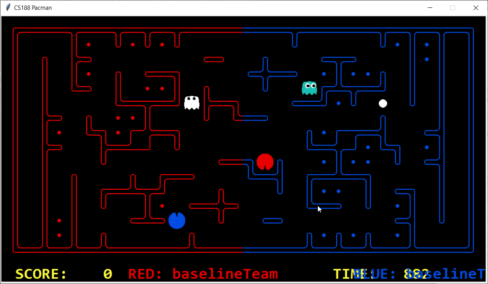

# Features #

### Offensive features

* deadEndWithActiveGhostNearbyFeature
* {1-3} stepsFromEnemyAgent1
* {1-3} stepsFromEnemyAgent2
* isSuccessorCloserToChoosenPoint
* closenessToOptimizedFood
* ActionsAvailableActiveGhostNearbyFeature
* foodEaten
* capsuleEatenWithEnemyNearBy

### Defensive features

* becomesPacman
* isSuccessorCloserToChosenPoint
* {1-3} stepsFromEnemyAgent1
* {1-3} stepsFromEnemyAgent2

### Hybrid (reflexive) features

*

***Please note that, for clarity, the agents in the demos will be referenced by their respective colour - i.e. red & orange for the RED team, blue & teal for the BLUE team. Our agents may switch from either team throughout each video, but will be identified under the respective demo.***

***feature name***
*  problem feature is intended to address:
*  Effectiveness of feature in addressing that problem:

## Offensive agent - fleeing from enemy ghost, (and pacman!)

Our agent is the blue offensive agent. Our first attempt at attempting to stop our offensive agent from dying to enemy agents was to add a feature of maze distance to attempt to maximise it from an encountered enemy. 

# Demo

A pitfall of the first feature is demonstrated here. Our Red offensive while maximizing the distance enters in dead end and get caught by enemy agents. 

Problem with 1...leading to dead ends

3- Possible solution of 1 by adding future available actions as a feature... caused further problem of back-forth movement
Iterative depth search - Attempting to maximise sum of possible future actions 7 steps ahead. 
Considers past position states which leads to back and forth movement which attempts to maximise

4- Solving 3 by calculating future value only when opponent is in proximity (taken the product of both features and used same weight). Improved problem of 2 as well. A new problem arises. Offensive agent keep moving around nearest Food if an opponent is present. Possible solution is to add a feature that measured distance from nearest food to VisibleGhost as well. while calculating future available actions for each successor, add a penalty to the successor which might lead lead to ghost. 
(Lead to a possible future weakness of agent moving back and forth)

5. Instead of solving above problem first,  added new future to check ratio of available food/nonavaiable food to n-depth. The idea is to favour paths where more food is availble compared to lower food. It became a challenge to adjust weight b/w feature minimumDistanceToFood and this feature, because they are related. Distance to Nearest Food is favoured to solve Pacman confusions. Added chasing scared ghost feature to Offensive agent.

6. To solve problem as specified  in 4 in which opponent is not moving away from food nearest to our agent, added a new feature to measure distance of opponent agent (if visible) to nearest Food, and direct to agent to start moving towards some other random food.

8. We are red_Look at blue how it is stuck. Our agent avoid such behavior by killing it self as there is no way out

# Normalisation