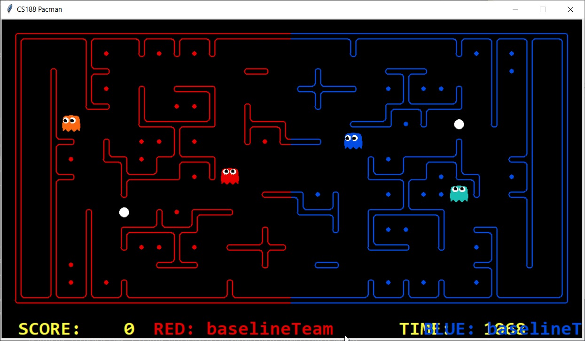
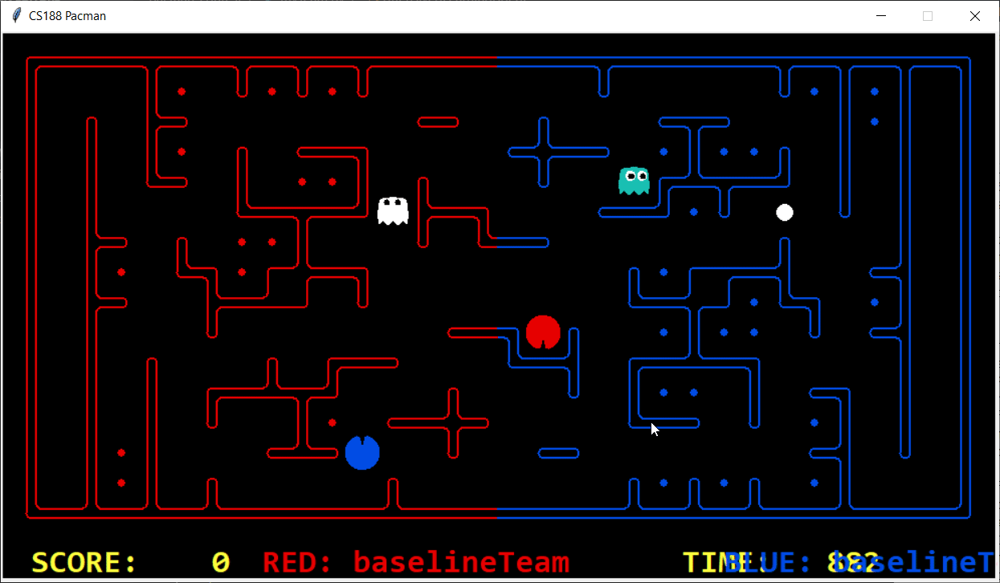
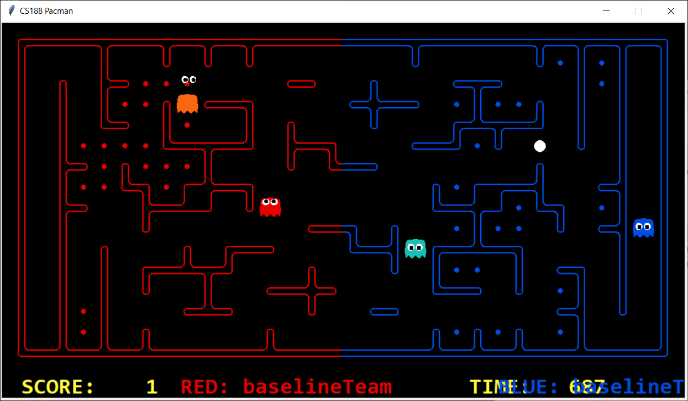
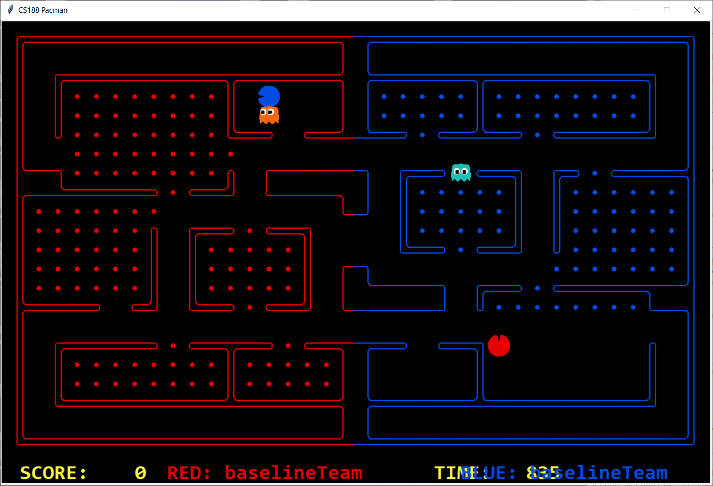
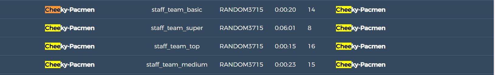

Experimental evolution, along with associated replays are illustrated below. After evolving, our agent was able to beat staff_medium_team and occassionally top (rarely super team). The next step, from 7th October, was continuously monitor our agent and improve it from replays available from tournaments or staff_teams. It was then re-trained to account for the updated feature representation. The evolutionary process and the tournament results after this phase are presented below.

## Offensive agent - fleeing from enemy ghost, (and pacman!)

Our agent is the blue offensive agent. Our first attempt to stop our offensive agent from being eaten by enemy agents was to add a feature to maximise the maze distance from an encountered enemy. 

# Demo

A pitfall of the first feature is demonstrated here - our Red offensive agent enters a dead end and is caught by the enemy agent. 

3- A possible solution was to add a feature which assessed the number of future actions available. This did not worked as expected. We found it difficult to favour paths closer to food or paths with more possible actions. As a result the agent remained confused as to go where. This confusion is clearly evident in the attached replay (red agent) from 1100-1000 [3_replay-Problem](uploads/91cb0bffcb7f3812888045b7d05c7379/3_replay-Problem)

4- To solve the confusion above, we added a simple condition - only consider the future distance when the enemy is nearby. After all the agent should (in most cases) avoid dead ends (with or without food) when the enemy is nearby. We therefore solved *3* by calculating future value only when opponent is in proximity.
The replay below from between 1200 and 950 (red) it can be clearly seen that pacman is no more confused and it also avoids dead end when enemy is nearby. We only considered a depth of 7 with this feature at that time.[4_replay](uploads/164dc8bc3345304bd907ec1e40a75c6f/4_replay) 

Inspired with success of 4, we added new future to check ratio of available food/nonavaiable food to n-depth. The idea is to favour paths where more food is availble compared to lower food. However,  It became a challenge to adjust weight b/w feature minimumDistanceToFood and this feature (they are both related to Food and indirectly to food distances). This proved to be a bad feature as pacman keeps roaming randomly and moving back and forth, and there was no obvious solution. We dropped that feature.

5.  After that we added a feature to chasing scared ghost by Defensive agent. (We also added it to offensive agent when it is in home teritory Later on we found experimentally that this feature is causing offensive agent to forget its actual work of collecting food and focus on eating enemies in home territory. Hence we removed it). This feature can be seen in replay below from 500-300[5-replay-OffensiveAgentCanChaseScaredOpponents](uploads/e0d9b51713f67a7b2f5afa1c02d32bc4/5-replay-OffensiveAgentCanChaseScaredOpponents)

6. We have observed a behaviour as shown below. Our offensive blue agent is trapped b/w wall and enemy and food collection is halted.

To avoid such halting of food collection. there are two possibilities. First is to never let pacman go into such a situation. However it is very difficult to avoid. So we added a logic that detects if our agent is trapped b/w wall and enemy if it remains trapped for six states, it will kill itself by rushing into enemy. This atleast avoids complete halt of food collection. Between 350-250 in below replay our red agent kills itself[CahllengeReplay_Offensive](uploads/401c3eec83b2eb3d99748ee17cc99380/CahllengeReplay_Offensive)

Problem: On 7th October we found out that our agent is entering into the dead ends and getting killed. See the replay below
between 1000-800 against staff super team (our agent is red) entering dead end.[Cheeky-Pacmen_vs_staff_team_super_RANDOM1292.replay](uploads/0a9d003bd5831487c091254d22582513/Cheeky-Pacmen_vs_staff_team_super_RANDOM1292.replay)

Solution: We have added a feature to check number of available actions for a successor node and avoid successors where few actions are available (we defined no limit for few. More action is preferred always)

Problem: On 8th October tournamnet we found out that our offensive agent is continuously exceeding the time limit to make a move and crushing.

[Cheeky-Pacmen_vs_staff_team_medium_contest16Capture.log](uploads/52f1eebb933d3e63e4b05121f3a859c3/Cheeky-Pacmen_vs_staff_team_medium_contest16Capture.log)

Solution: We figured out that getting number of actions available to a depth of n with n>8 is causing this problem. This is an important feature to find out dead ends and avoid pacman falling into it when being chased by enemy agent. We have rewritten an efficient algorithm to find out this depth using IDS. With the new version we can work on n>50 and time limit still not exceed.

Between 8th and 11th October we invested our time heavily on making offensive agent cross the border to enemy territory specially when there are only few entry points. We also invested our time to avoid the back and forth movement of the pacman. The solution to both the problem was randomness.( will explain more later..............)

Problem: (during 11th October) We have added a feature in which agent self kill itself when it is stuck between and enemy ghost agent and wall. The enemy is not killing us and the offensive pacman remains at halt. We have found out that the feature was not working correctly and agent is killing itself randomly. The prooblem is shown is the replay below at around time 600-500.
[Cheeky-Pacmen_vs_staff_team_super_RANDOM4214.replay](uploads/83034c46a0d216eacd086f4e97bd995e/Cheeky-Pacmen_vs_staff_team_super_RANDOM4214.replay).

Solution: The bug was debugged and agent performed well after wards. 

 (On 12th October)
Problem: Pacman will return home after eating one-third food. In the problem below against staff team super and top, our team lost because Pacman collected enough food but it does not focus on returning home when few time is left and hence we lost.

[Cheeky-Pacmen_vs_staff_team_super_RANDOM1522_This_gives_us_the_hint_that_when_less_than_200_time_is_left_we_must_go_back.replay](uploads/2366f79908f4fc80ae96eb7a93b148b0/Cheeky-Pacmen_vs_staff_team_super_RANDOM1522_This_gives_us_the_hint_that_when_less_than_200_time_is_left_we_must_go_back.replay)

[Cheeky-Pacmen_vs_staff_team_top_RANDOM1522_This_gives_us_hint_that_when_small_time_is_left_go_back_home.replay](uploads/358ee05c1abb31112b0bc01ff9407dfc/Cheeky-Pacmen_vs_staff_team_top_RANDOM1522_This_gives_us_hint_that_when_small_time_is_left_go_back_home.replay)

Solution: WE have added a condition that when less than 200 unit of time is left, pacman will focus on returning home, in any case. After adding this condition we won against all staff-teams on 12th october at 8am session.

# Evolution of the approach

You can include screenshots of precompetition results and animated gifs, to showcase the evolution of your agents.

Evolution| Percentile |Date|Position|No. teams|Points	|Win	|Tie	|Lost	|TOTAL	|FAILED|	Score balance|
|--------|---|---|---|---|---|---|---|---|---|---|---|
|4|0.425|11/10/2019|17|40|136|44|4|30|78|0|-34|
|3|0.18|09/10/2019|6|33|139|43|10|11|64|0|225|
|2|0.83|08/10/2019|24|29|42|14|0|42|56|39|-66|
|1|0.54|07/10/2019|13|23|66|21|3|22|46|0|-19|

## Evolution 1 | Competition results: Position - X/X | Percentile - X%
----

Description

### Evolution 1 Demo

Demo description

#### Strategy summary

| Pros | Cons |
|-----------------|:-------------|
| First body part | Second cell  |
| Second line     | foo          |

## Evolution 2 | Competition results: Position - X/X | Percentile - X%
----

Description

### Evolution 2 Demo

Demo description

#### Strategy summary

| Pros | Cons |
|-----------------|:-------------|
| First body part | Second cell  |
| Second line     | foo          |

## Evolution 3 | Competition results: Position - X/X | Percentile - X%
----

Description

### Evolution 3 Demo

Demo description

#### Strategy summary

| Pros | Cons |
|-----------------|:-------------|
| First body part | Second cell  |
| Second line     | foo          |

## Evolution 4 | Competition results: Position - X/X | Percentile - X%
----

Description

### Evolution 4 Demo

Demo description

#### Strategy summary

| Pros | Cons |
|-----------------|:-------------|
| First body part | Second cell  |
| Second line     | foo          |

[Previous Page](/3_approach_evolution)| [Next Page](/4_conclusion)