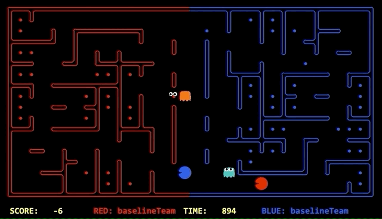
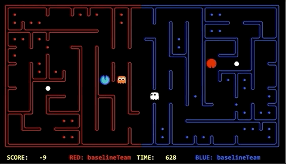

Experimental evolution, along with associated replays are illustrated below. We continuously monitored our agent and improved it from replays available from tournaments or staff_teams. It was then re-trained to account for the updated feature representation. The evolutionary process and the tournament results after this phase are presented below.

# Evolution of the approach

#|Percentile|Date|Pos|No. teams|Points|Win|Tie|Lost|TOTAL|FAILED|Score balance|
|--------|---|---|---|---|---|---|---|---|---|---|---|
|1|54%|07/10/2019|13|23|66|21|3|22|46|0|-19|
|2|83%|08/10/2019|24|29|42|14|0|42|56|39|-66|
|3|18%|09/10/2019|6|33|139|43|10|11|64|0|225|
|4|42%|11/10/2019|17|40|136|44|4|30|78|0|-34|
|5|9%|12/10/2019|4|47|203|64|11|17|92|0|447|
|6||13/10/2019|

Our evolutions seem to demonstrate good general progress, however it is difficult to assert certainty because of the low sample sizing of nightly competitions.

## Evolution 1 | Competition results: Position - 13/23 | Percentile - 54%
----

On 7th October we found out that our agent was entering into the dead ends and getting killed. This was primarily due to the fact that we did not implement any 'look ahead' features. As a result, the learning process assigned a high priority to following (or escaping) enemy agents, as opposed to finding the optimal path. As identified earlier, this was one of the pitfalls with approximate Q-learning - if we did not implement effective features, the learning process would skew towards sub-optimal states.

To solve this we have added a [heuristic search algorithm](/3.2 Heuristic Search Algorithms) to determine what paths to take. The heuristic looked ahead to check number of available actions to n-depth and avoid entering a position that limited the number of actions available.

### Evolution 1 demo

#### Stuck behind a wall
In the following example, our agent (orange) is stuck behind a wall and cannot eat the enemy.


#### Strategy summary

| Pros | Cons |
|-----------------|:-------------|
| Avoid getting stuck in dead-ends | Agent sometimes overlooked food that was placed in a dead-end  |
| Find optimal paths    | Increased computation time |

## Evolution 2 | Competition results: Position - 24/29 | Percentile - 83%
----

We found out that our offensive agent was continuously exceeding the time limit to make a move and crashing.

We figured out that getting number of actions available to a depth of n with n>8 was causing this problem. This was an important feature to find dead ends and avoid them when being chased by enemy agent. To improve this, we wrote an efficient [heuristic search algorithm](/3.2 Heuristic Search Algorithms) to find out this depth using IDS. With the new version we can work on n>50 and not exceed the time limit.

### Evolution 2 demo

```
Agent 0 took too long to make a move! This is warning 1
Agent 0 took too long to make a move! This is warning 2
Agent 0 took too long to make a move! This is warning 3
Agent 0 exceeded the maximum number of warnings: 3
Red agent crashed
recorded

Total Time Game: 12.0
```

## Evolution 3 | Competition results: Position - 6/33 | Percentile - 18%
----

The entry point for an offensive agent attacking, and the point at which the defensive agent would rest was initially set to the centre point of the map. The issue with this approach was that smart agents would often go around ours and attack before we had time to react.

Perhaps surprisingly, we found, in the absence of enemy detection the best approach required randomisation. Our presumption was that smart agents were using probabilistic models to infer our position. As we were using a deterministic approach they were able to capitalise on our behaviour. 

This action was only chosen as a last resort. Prioritised above this was our [goal recognition technique](/3.2 Heuristic Search Algorithms) for inferring enemies through the food they have eaten.
  
We also focused on eliminating any back and forth repetitions.

### Evolution 3 demo
#### Enemy looping around agent
In the following example our agent (orange) is resting in the middle of the map. Due to it sitting in one location the blue offensive agent is able to sneak around the outside of the map and attack our position.



#### Inferring using food eaten
Fortunately our agent was very good at inferring opponent position use our [goal recognition technique](/3.2 Heuristic Search Algorithms). As evidenced below, our orange defensive agent was able to identify the blue agent was in its territory once it ate some food.


#### Strategy summary

| Pros | Cons |
|-----------------|:-------------|
| Assisted in avoiding detection | Match results had a difficult to predict non-deterministic element |
| Prevented getting stuck in the centre     | Impacted ability to learn from this feature      |

## Evolution 4 | Competition results: Position - 17/40 | Percentile - 42%
----

The evolution tested on 11th October integrated a feature in which the agent would kill itself when stuck between an enemy ghost agent and a wall. Superior agents would trap our agent and remove any ability to play the game. We found out that the feature was not working correctly and the agent was killing itself randomly - which could be a possible justification for our low percentile for this evolution's nightly competition.

At this stage our reward function was defined as: `1 - (DistanceToFood/TotalFood) + Score`. This was inhibiting the agents ability to learn a 'suicide' move as it would lead to the agent being a long distance away from food. At this junction, we reassessed our approach for reward shaping and altered it to: `FoodLeft/StartingFood + Score`, which would also later be further improved to incremental positive score changes as discussed in section '3.1 Approximate Q-learning'.

### Evolution 4 demo

the replay below at around time 600-500.
[Cheeky-Pacmen_vs_staff_team_super_RANDOM4214.replay](uploads/83034c46a0d216eacd086f4e97bd995e/Cheeky-Pacmen_vs_staff_team_super_RANDOM4214.replay).

#### Strategy summary

| Pros | Cons |
|-----------------|:-------------|
| Game theory allowed elimination of dominated strategies| Some situations are not easily applicable to game theory |
| Allowed for generalisation in well-defined cases    | Risk of non-generalisation when ill-defined |
| Rewards re-shaped to properly incentivise offensive agents | Initial ill-defined rewards led to bad incentives in this night's test|

## Evolution 5 | Competition results: Position - 4/47 | Percentile - 9%
----

On 12th October the agent would return home after eating one-third food. In the problem below against staff_team_super and staff_team_top our team lost because the agent collected enough food but did not focus on returning home when the time was running out. We added a condition that when less than 200 unit of time is left, pacman will focus on returning home, in any case. After adding this condition we won against all staff-teams on 12th october in the 8am session.

This evolution included an important shift in the Q-learning rewards, whereby we attempted to isolate rewards of offensive and defensive agents so that their performance did not influence each other's rewards. Further explanation can be found in section [3.1 Approximate Q-learning](/3.1 Approximate Q-learning). In general, this allowed our agents to better learn how to weight features to maximise their own performance as opposed to being misled - for example, a defensive agent can think it is improving with our previous reward shaping, however, it could just be misled by our offensive agent's improved performance.


### Evolution 5 demo

#### Agent not returning home
In the following example, our offensive agent (red) has eaten a significant amount of food. Unfortunately, he is still hungry and not willing to deposit the food, causing the team to lose as the time runs out.


### Success in beating all staff!


#### Strategy summary

| Pros | Cons |
|-----------------|:-------------|
| Independent reward shaping for offensive and defensive agents | Difficulty in creating hybrid agents unless rewards are re-adjusted |
| Offensive agents are more time-conscious   | If time conditions are not well generalised, this could lead to sub-optimal behaviour|


## Evolution 6 | Competition results: Position -  | Percentile - 
----

Once we successfully climbed the leader-board, we turned our attention to beating the staff_team_super. In order to do so we recognised we had to consider our agents as a team, as opposed to individuals. To do this we implemented a 'toggle' that enabled agents to switch between offensive and defensive. Doing so allowed them to strive for a global optimum as opposed to having individuals objectives. 

### Evolution 6 demo

This demonstration shows the blue defensive player turning offensive. The agent chose to do this as the enemy ate a capsuled and it became scared.



# Future possible evolutions

Given more time and additional resources, potential evolutions that could improve the performance of our agents are:
*  Adapting to a multi 'hybrid' agent problem, with reward functions adjusted to reward overall behaviour of the agents, including cooperative behaviour.
* Creating a more rigourous structure that allows for testing and ensuring generalisation of certain conditional decision-making. We did not have time to implement all conditions as effective and well-defined features for input into our Q-learning technique, so provided with more time, we would strive to do this to ensure improved generalisation and optimality convergence.
* Create a feedback loop of evolutions so that they are tested against each other, in an attempt to increase the sample size of varying agent behaviours - which is currently restricted to the nightly competitions and is unsufficient for statistical significance testing. Or somehow find a pool of agents that can be tested as such within the rules of the competition.

[Previous Page](/3_approach_evolution)| [Next Page](/4_conclusion)